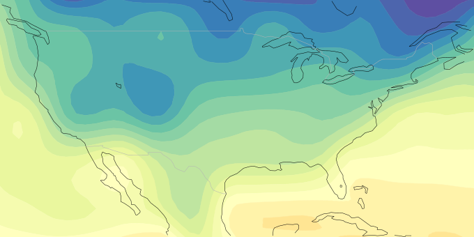
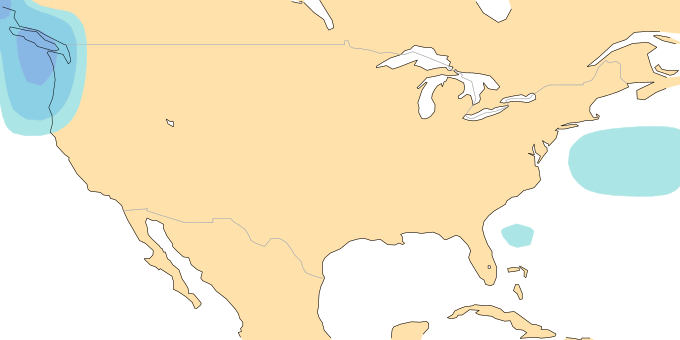
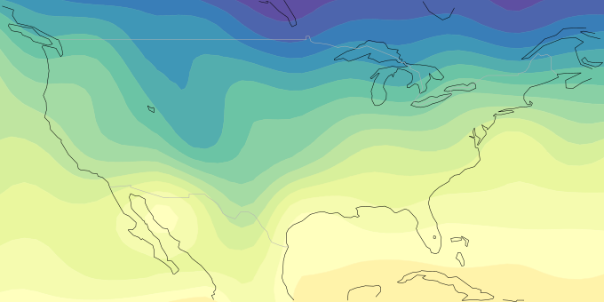
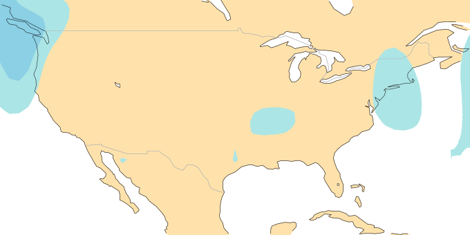

# Simple Neural Networks

First, we create a simpler CNN architecture. 


```python
import numpy as np
import matplotlib.pyplot as plt
import xarray as xr
import tensorflow as tf
import tensorflow.keras as keras
from tensorflow.keras.layers import *
import tensorflow.keras.backend as K
import pickle
from utils import *
from data import DataGenerator
from cnn import *
from collections import OrderedDict
```

# Convolutional Neural Network


```python
# Load Data
us_temp_data = xr.open_mfdataset('data/us_temperature.nc').t2m
us_rain_data = xr.open_mfdataset('data/us_precipitation.nc').tp

us_temp_data = us_temp_data[7:]
assert np.all(us_rain_data.time == us_temp_data.time)
ds = xr.merge([us_temp_data, us_rain_data])

# Split into train and test data
ds_train = normalize(ds.sel(time=slice('2016')))
ds_test = normalize(ds.sel(time=slice('11/01/2018', '12/31/2018')))
ds_test_data = normalize(ds.sel(time=slice('2017', '2018')))
valid = normalize(ds.sel(time=slice('2017', '2018')))

_, nlat, nlon = ds_train.t2m.shape
```


```python
ds_train
```


<div><svg style="position: absolute; width: 0; height: 0; overflow: hidden">
<defs>
<symbol id="icon-database" viewBox="0 0 32 32">
<path d="M16 0c-8.837 0-16 2.239-16 5v4c0 2.761 7.163 5 16 5s16-2.239 16-5v-4c0-2.761-7.163-5-16-5z"></path>
<path d="M16 17c-8.837 0-16-2.239-16-5v6c0 2.761 7.163 5 16 5s16-2.239 16-5v-6c0 2.761-7.163 5-16 5z"></path>
<path d="M16 26c-8.837 0-16-2.239-16-5v6c0 2.761 7.163 5 16 5s16-2.239 16-5v-6c0 2.761-7.163 5-16 5z"></path>
</symbol>
<symbol id="icon-file-text2" viewBox="0 0 32 32">
<path d="M28.681 7.159c-0.694-0.947-1.662-2.053-2.724-3.116s-2.169-2.030-3.116-2.724c-1.612-1.182-2.393-1.319-2.841-1.319h-15.5c-1.378 0-2.5 1.121-2.5 2.5v27c0 1.378 1.122 2.5 2.5 2.5h23c1.378 0 2.5-1.122 2.5-2.5v-19.5c0-0.448-0.137-1.23-1.319-2.841zM24.543 5.457c0.959 0.959 1.712 1.825 2.268 2.543h-4.811v-4.811c0.718 0.556 1.584 1.309 2.543 2.268zM28 29.5c0 0.271-0.229 0.5-0.5 0.5h-23c-0.271 0-0.5-0.229-0.5-0.5v-27c0-0.271 0.229-0.5 0.5-0.5 0 0 15.499-0 15.5 0v7c0 0.552 0.448 1 1 1h7v19.5z"></path>
<path d="M23 26h-14c-0.552 0-1-0.448-1-1s0.448-1 1-1h14c0.552 0 1 0.448 1 1s-0.448 1-1 1z"></path>
<path d="M23 22h-14c-0.552 0-1-0.448-1-1s0.448-1 1-1h14c0.552 0 1 0.448 1 1s-0.448 1-1 1z"></path>
<path d="M23 18h-14c-0.552 0-1-0.448-1-1s0.448-1 1-1h14c0.552 0 1 0.448 1 1s-0.448 1-1 1z"></path>
</symbol>
</defs>
</svg>
<style>/* CSS stylesheet for displaying xarray objects in jupyterlab.
 *
 */

:root {
  --xr-font-color0: var(--jp-content-font-color0, rgba(0, 0, 0, 1));
  --xr-font-color2: var(--jp-content-font-color2, rgba(0, 0, 0, 0.54));
  --xr-font-color3: var(--jp-content-font-color3, rgba(0, 0, 0, 0.38));
  --xr-border-color: var(--jp-border-color2, #e0e0e0);
  --xr-disabled-color: var(--jp-layout-color3, #bdbdbd);
  --xr-background-color: var(--jp-layout-color0, white);
  --xr-background-color-row-even: var(--jp-layout-color1, white);
  --xr-background-color-row-odd: var(--jp-layout-color2, #eeeeee);
}

html[theme=dark],
body.vscode-dark {
  --xr-font-color0: rgba(255, 255, 255, 1);
  --xr-font-color2: rgba(255, 255, 255, 0.54);
  --xr-font-color3: rgba(255, 255, 255, 0.38);
  --xr-border-color: #1F1F1F;
  --xr-disabled-color: #515151;
  --xr-background-color: #111111;
  --xr-background-color-row-even: #111111;
  --xr-background-color-row-odd: #313131;
}

.xr-wrap {
  display: block;
  min-width: 300px;
  max-width: 700px;
}

.xr-text-repr-fallback {
  /* fallback to plain text repr when CSS is not injected (untrusted notebook) */
  display: none;
}

.xr-header {
  padding-top: 6px;
  padding-bottom: 6px;
  margin-bottom: 4px;
  border-bottom: solid 1px var(--xr-border-color);
}

.xr-header > div,
.xr-header > ul {
  display: inline;
  margin-top: 0;
  margin-bottom: 0;
}

.xr-obj-type,
.xr-array-name {
  margin-left: 2px;
  margin-right: 10px;
}

.xr-obj-type {
  color: var(--xr-font-color2);
}

.xr-sections {
  padding-left: 0 !important;
  display: grid;
  grid-template-columns: 150px auto auto 1fr 20px 20px;
}

.xr-section-item {
  display: contents;
}

.xr-section-item input {
  display: none;
}

.xr-section-item input + label {
  color: var(--xr-disabled-color);
}

.xr-section-item input:enabled + label {
  cursor: pointer;
  color: var(--xr-font-color2);
}

.xr-section-item input:enabled + label:hover {
  color: var(--xr-font-color0);
}

.xr-section-summary {
  grid-column: 1;
  color: var(--xr-font-color2);
  font-weight: 500;
}

.xr-section-summary > span {
  display: inline-block;
  padding-left: 0.5em;
}

.xr-section-summary-in:disabled + label {
  color: var(--xr-font-color2);
}

.xr-section-summary-in + label:before {
  display: inline-block;
  content: '►';
  font-size: 11px;
  width: 15px;
  text-align: center;
}

.xr-section-summary-in:disabled + label:before {
  color: var(--xr-disabled-color);
}

.xr-section-summary-in:checked + label:before {
  content: '▼';
}

.xr-section-summary-in:checked + label > span {
  display: none;
}

.xr-section-summary,
.xr-section-inline-details {
  padding-top: 4px;
  padding-bottom: 4px;
}

.xr-section-inline-details {
  grid-column: 2 / -1;
}

.xr-section-details {
  display: none;
  grid-column: 1 / -1;
  margin-bottom: 5px;
}

.xr-section-summary-in:checked ~ .xr-section-details {
  display: contents;
}

.xr-array-wrap {
  grid-column: 1 / -1;
  display: grid;
  grid-template-columns: 20px auto;
}

.xr-array-wrap > label {
  grid-column: 1;
  vertical-align: top;
}

.xr-preview {
  color: var(--xr-font-color3);
}

.xr-array-preview,
.xr-array-data {
  padding: 0 5px !important;
  grid-column: 2;
}

.xr-array-data,
.xr-array-in:checked ~ .xr-array-preview {
  display: none;
}

.xr-array-in:checked ~ .xr-array-data,
.xr-array-preview {
  display: inline-block;
}

.xr-dim-list {
  display: inline-block !important;
  list-style: none;
  padding: 0 !important;
  margin: 0;
}

.xr-dim-list li {
  display: inline-block;
  padding: 0;
  margin: 0;
}

.xr-dim-list:before {
  content: '(';
}

.xr-dim-list:after {
  content: ')';
}

.xr-dim-list li:not(:last-child):after {
  content: ',';
  padding-right: 5px;
}

.xr-has-index {
  font-weight: bold;
}

.xr-var-list,
.xr-var-item {
  display: contents;
}

.xr-var-item > div,
.xr-var-item label,
.xr-var-item > .xr-var-name span {
  background-color: var(--xr-background-color-row-even);
  margin-bottom: 0;
}

.xr-var-item > .xr-var-name:hover span {
  padding-right: 5px;
}

.xr-var-list > li:nth-child(odd) > div,
.xr-var-list > li:nth-child(odd) > label,
.xr-var-list > li:nth-child(odd) > .xr-var-name span {
  background-color: var(--xr-background-color-row-odd);
}

.xr-var-name {
  grid-column: 1;
}

.xr-var-dims {
  grid-column: 2;
}

.xr-var-dtype {
  grid-column: 3;
  text-align: right;
  color: var(--xr-font-color2);
}

.xr-var-preview {
  grid-column: 4;
}

.xr-var-name,
.xr-var-dims,
.xr-var-dtype,
.xr-preview,
.xr-attrs dt {
  white-space: nowrap;
  overflow: hidden;
  text-overflow: ellipsis;
  padding-right: 10px;
}

.xr-var-name:hover,
.xr-var-dims:hover,
.xr-var-dtype:hover,
.xr-attrs dt:hover {
  overflow: visible;
  width: auto;
  z-index: 1;
}

.xr-var-attrs,
.xr-var-data {
  display: none;
  background-color: var(--xr-background-color) !important;
  padding-bottom: 5px !important;
}

.xr-var-attrs-in:checked ~ .xr-var-attrs,
.xr-var-data-in:checked ~ .xr-var-data {
  display: block;
}

.xr-var-data > table {
  float: right;
}

.xr-var-name span,
.xr-var-data,
.xr-attrs {
  padding-left: 25px !important;
}

.xr-attrs,
.xr-var-attrs,
.xr-var-data {
  grid-column: 1 / -1;
}

dl.xr-attrs {
  padding: 0;
  margin: 0;
  display: grid;
  grid-template-columns: 125px auto;
}

.xr-attrs dt,
.xr-attrs dd {
  padding: 0;
  margin: 0;
  float: left;
  padding-right: 10px;
  width: auto;
}

.xr-attrs dt {
  font-weight: normal;
  grid-column: 1;
}

.xr-attrs dt:hover span {
  display: inline-block;
  background: var(--xr-background-color);
  padding-right: 10px;
}

.xr-attrs dd {
  grid-column: 2;
  white-space: pre-wrap;
  word-break: break-all;
}

.xr-icon-database,
.xr-icon-file-text2 {
  display: inline-block;
  vertical-align: middle;
  width: 1em;
  height: 1.5em !important;
  stroke-width: 0;
  stroke: currentColor;
  fill: currentColor;
}
</style><pre class='xr-text-repr-fallback'>&lt;xarray.Dataset&gt;
Dimensions:  (lon: 13, lat: 7, time: 333113)
Coordinates:
  * lon      (lon) float64 230.6 236.2 241.9 247.5 ... 281.2 286.9 292.5 298.1
  * lat      (lat) float64 19.69 25.31 30.94 36.56 42.19 47.81 53.44
  * time     (time) datetime64[ns] 1979-01-01T07:00:00 ... 2016-12-31T23:00:00
Data variables:
    t2m      (time, lat, lon) float32 dask.array&lt;chunksize=(333113, 7, 13), meta=np.ndarray&gt;
    tp       (time, lat, lon) float32 dask.array&lt;chunksize=(333113, 7, 13), meta=np.ndarray&gt;</pre><div class='xr-wrap' hidden><div class='xr-header'><div class='xr-obj-type'>xarray.Dataset</div></div><ul class='xr-sections'><li class='xr-section-item'><input id='section-18f48c64-f098-468d-a844-1d77ee04a20d' class='xr-section-summary-in' type='checkbox' disabled ><label for='section-18f48c64-f098-468d-a844-1d77ee04a20d' class='xr-section-summary'  title='Expand/collapse section'>Dimensions:</label><div class='xr-section-inline-details'><ul class='xr-dim-list'><li><span class='xr-has-index'>lon</span>: 13</li><li><span class='xr-has-index'>lat</span>: 7</li><li><span class='xr-has-index'>time</span>: 333113</li></ul></div><div class='xr-section-details'></div></li><li class='xr-section-item'><input id='section-1b5c588c-fc24-4764-a9e5-1f070771fac2' class='xr-section-summary-in' type='checkbox'  checked><label for='section-1b5c588c-fc24-4764-a9e5-1f070771fac2' class='xr-section-summary' >Coordinates: <span>(3)</span></label><div class='xr-section-inline-details'></div><div class='xr-section-details'><ul class='xr-var-list'><li class='xr-var-item'><div class='xr-var-name'><span class='xr-has-index'>lon</span></div><div class='xr-var-dims'>(lon)</div><div class='xr-var-dtype'>float64</div><div class='xr-var-preview xr-preview'>230.6 236.2 241.9 ... 292.5 298.1</div><input id='attrs-a0158ae3-c65a-4b91-b7b9-997fe8f5fd32' class='xr-var-attrs-in' type='checkbox' disabled><label for='attrs-a0158ae3-c65a-4b91-b7b9-997fe8f5fd32' title='Show/Hide attributes'><svg class='icon xr-icon-file-text2'><use xlink:href='#icon-file-text2'></use></svg></label><input id='data-a816658a-1a48-4331-857f-77a4db7e53f5' class='xr-var-data-in' type='checkbox'><label for='data-a816658a-1a48-4331-857f-77a4db7e53f5' title='Show/Hide data repr'><svg class='icon xr-icon-database'><use xlink:href='#icon-database'></use></svg></label><div class='xr-var-attrs'><dl class='xr-attrs'></dl></div><div class='xr-var-data'><pre>array([230.625, 236.25 , 241.875, 247.5  , 253.125, 258.75 , 264.375, 270.   ,
       275.625, 281.25 , 286.875, 292.5  , 298.125])</pre></div></li><li class='xr-var-item'><div class='xr-var-name'><span class='xr-has-index'>lat</span></div><div class='xr-var-dims'>(lat)</div><div class='xr-var-dtype'>float64</div><div class='xr-var-preview xr-preview'>19.69 25.31 30.94 ... 47.81 53.44</div><input id='attrs-451f1a8a-f205-461d-8dce-b1cf14a93c8d' class='xr-var-attrs-in' type='checkbox' disabled><label for='attrs-451f1a8a-f205-461d-8dce-b1cf14a93c8d' title='Show/Hide attributes'><svg class='icon xr-icon-file-text2'><use xlink:href='#icon-file-text2'></use></svg></label><input id='data-6d6d77ac-4615-44bc-bcf0-b98cc00a9d78' class='xr-var-data-in' type='checkbox'><label for='data-6d6d77ac-4615-44bc-bcf0-b98cc00a9d78' title='Show/Hide data repr'><svg class='icon xr-icon-database'><use xlink:href='#icon-database'></use></svg></label><div class='xr-var-attrs'><dl class='xr-attrs'></dl></div><div class='xr-var-data'><pre>array([19.6875, 25.3125, 30.9375, 36.5625, 42.1875, 47.8125, 53.4375])</pre></div></li><li class='xr-var-item'><div class='xr-var-name'><span class='xr-has-index'>time</span></div><div class='xr-var-dims'>(time)</div><div class='xr-var-dtype'>datetime64[ns]</div><div class='xr-var-preview xr-preview'>1979-01-01T07:00:00 ... 2016-12-...</div><input id='attrs-0ca724d6-3aae-4e8f-b88a-a6e273486bd9' class='xr-var-attrs-in' type='checkbox' ><label for='attrs-0ca724d6-3aae-4e8f-b88a-a6e273486bd9' title='Show/Hide attributes'><svg class='icon xr-icon-file-text2'><use xlink:href='#icon-file-text2'></use></svg></label><input id='data-f65efbc8-76df-4af3-859d-fa9c640b1141' class='xr-var-data-in' type='checkbox'><label for='data-f65efbc8-76df-4af3-859d-fa9c640b1141' title='Show/Hide data repr'><svg class='icon xr-icon-database'><use xlink:href='#icon-database'></use></svg></label><div class='xr-var-attrs'><dl class='xr-attrs'><dt><span>long_name :</span></dt><dd>time</dd></dl></div><div class='xr-var-data'><pre>array([&#x27;1979-01-01T07:00:00.000000000&#x27;, &#x27;1979-01-01T08:00:00.000000000&#x27;,
       &#x27;1979-01-01T09:00:00.000000000&#x27;, ..., &#x27;2016-12-31T21:00:00.000000000&#x27;,
       &#x27;2016-12-31T22:00:00.000000000&#x27;, &#x27;2016-12-31T23:00:00.000000000&#x27;],
      dtype=&#x27;datetime64[ns]&#x27;)</pre></div></li></ul></div></li><li class='xr-section-item'><input id='section-966d63db-560c-4f5a-b2e0-837601db32ea' class='xr-section-summary-in' type='checkbox'  checked><label for='section-966d63db-560c-4f5a-b2e0-837601db32ea' class='xr-section-summary' >Data variables: <span>(2)</span></label><div class='xr-section-inline-details'></div><div class='xr-section-details'><ul class='xr-var-list'><li class='xr-var-item'><div class='xr-var-name'><span>t2m</span></div><div class='xr-var-dims'>(time, lat, lon)</div><div class='xr-var-dtype'>float32</div><div class='xr-var-preview xr-preview'>dask.array&lt;chunksize=(333113, 7, 13), meta=np.ndarray&gt;</div><input id='attrs-8c89477c-9001-45c2-a389-31b934e73abf' class='xr-var-attrs-in' type='checkbox' disabled><label for='attrs-8c89477c-9001-45c2-a389-31b934e73abf' title='Show/Hide attributes'><svg class='icon xr-icon-file-text2'><use xlink:href='#icon-file-text2'></use></svg></label><input id='data-4c287a66-525b-49cc-b2e1-fad5b5341ef4' class='xr-var-data-in' type='checkbox'><label for='data-4c287a66-525b-49cc-b2e1-fad5b5341ef4' title='Show/Hide data repr'><svg class='icon xr-icon-database'><use xlink:href='#icon-database'></use></svg></label><div class='xr-var-attrs'><dl class='xr-attrs'></dl></div><div class='xr-var-data'><table>
<tr>
<td>
<table>
  <thead>
    <tr><td> </td><th> Array </th><th> Chunk </th></tr>
  </thead>
  <tbody>
    <tr><th> Bytes </th><td> 121.25 MB </td> <td> 121.25 MB </td></tr>
    <tr><th> Shape </th><td> (333113, 7, 13) </td> <td> (333113, 7, 13) </td></tr>
    <tr><th> Count </th><td> 8 Tasks </td><td> 1 Chunks </td></tr>
    <tr><th> Type </th><td> float32 </td><td> numpy.ndarray </td></tr>
  </tbody>
</table>
</td>
<td>
<svg width="156" height="146" style="stroke:rgb(0,0,0);stroke-width:1" >

  <!-- Horizontal lines -->
  <line x1="10" y1="0" x2="80" y2="70" style="stroke-width:2" />
  <line x1="10" y1="25" x2="80" y2="96" style="stroke-width:2" />

  <!-- Vertical lines -->
  <line x1="10" y1="0" x2="10" y2="25" style="stroke-width:2" />
  <line x1="80" y1="70" x2="80" y2="96" style="stroke-width:2" />

  <!-- Colored Rectangle -->
  <polygon points="10.000000,0.000000 80.588235,70.588235 80.588235,96.000852 10.000000,25.412617" style="fill:#ECB172A0;stroke-width:0"/>

  <!-- Horizontal lines -->
  <line x1="10" y1="0" x2="35" y2="0" style="stroke-width:2" />
  <line x1="80" y1="70" x2="106" y2="70" style="stroke-width:2" />

  <!-- Vertical lines -->
  <line x1="10" y1="0" x2="80" y2="70" style="stroke-width:2" />
  <line x1="35" y1="0" x2="106" y2="70" style="stroke-width:2" />

  <!-- Colored Rectangle -->
  <polygon points="10.000000,0.000000 35.412617,0.000000 106.000852,70.588235 80.588235,70.588235" style="fill:#ECB172A0;stroke-width:0"/>

  <!-- Horizontal lines -->
  <line x1="80" y1="70" x2="106" y2="70" style="stroke-width:2" />
  <line x1="80" y1="96" x2="106" y2="96" style="stroke-width:2" />

  <!-- Vertical lines -->
  <line x1="80" y1="70" x2="80" y2="96" style="stroke-width:2" />
  <line x1="106" y1="70" x2="106" y2="96" style="stroke-width:2" />

  <!-- Colored Rectangle -->
  <polygon points="80.588235,70.588235 106.000852,70.588235 106.000852,96.000852 80.588235,96.000852" style="fill:#ECB172A0;stroke-width:0"/>

  <!-- Text -->
  <text x="93.294544" y="116.000852" font-size="1.0rem" font-weight="100" text-anchor="middle" >13</text>
  <text x="126.000852" y="83.294544" font-size="1.0rem" font-weight="100" text-anchor="middle" transform="rotate(0,126.000852,83.294544)">7</text>
  <text x="35.294118" y="80.706734" font-size="1.0rem" font-weight="100" text-anchor="middle" transform="rotate(45,35.294118,80.706734)">333113</text>
</svg>
</td>
</tr>
</table></div></li><li class='xr-var-item'><div class='xr-var-name'><span>tp</span></div><div class='xr-var-dims'>(time, lat, lon)</div><div class='xr-var-dtype'>float32</div><div class='xr-var-preview xr-preview'>dask.array&lt;chunksize=(333113, 7, 13), meta=np.ndarray&gt;</div><input id='attrs-372b1a3f-65e4-4ff8-8651-205de2bc4ca5' class='xr-var-attrs-in' type='checkbox' disabled><label for='attrs-372b1a3f-65e4-4ff8-8651-205de2bc4ca5' title='Show/Hide attributes'><svg class='icon xr-icon-file-text2'><use xlink:href='#icon-file-text2'></use></svg></label><input id='data-3e1cc9b4-45cb-4e30-a947-18f56c2f9f9d' class='xr-var-data-in' type='checkbox'><label for='data-3e1cc9b4-45cb-4e30-a947-18f56c2f9f9d' title='Show/Hide data repr'><svg class='icon xr-icon-database'><use xlink:href='#icon-database'></use></svg></label><div class='xr-var-attrs'><dl class='xr-attrs'></dl></div><div class='xr-var-data'><table>
<tr>
<td>
<table>
  <thead>
    <tr><td> </td><th> Array </th><th> Chunk </th></tr>
  </thead>
  <tbody>
    <tr><th> Bytes </th><td> 121.25 MB </td> <td> 121.25 MB </td></tr>
    <tr><th> Shape </th><td> (333113, 7, 13) </td> <td> (333113, 7, 13) </td></tr>
    <tr><th> Count </th><td> 7 Tasks </td><td> 1 Chunks </td></tr>
    <tr><th> Type </th><td> float32 </td><td> numpy.ndarray </td></tr>
  </tbody>
</table>
</td>
<td>
<svg width="156" height="146" style="stroke:rgb(0,0,0);stroke-width:1" >

  <!-- Horizontal lines -->
  <line x1="10" y1="0" x2="80" y2="70" style="stroke-width:2" />
  <line x1="10" y1="25" x2="80" y2="96" style="stroke-width:2" />

  <!-- Vertical lines -->
  <line x1="10" y1="0" x2="10" y2="25" style="stroke-width:2" />
  <line x1="80" y1="70" x2="80" y2="96" style="stroke-width:2" />

  <!-- Colored Rectangle -->
  <polygon points="10.000000,0.000000 80.588235,70.588235 80.588235,96.000852 10.000000,25.412617" style="fill:#ECB172A0;stroke-width:0"/>

  <!-- Horizontal lines -->
  <line x1="10" y1="0" x2="35" y2="0" style="stroke-width:2" />
  <line x1="80" y1="70" x2="106" y2="70" style="stroke-width:2" />

  <!-- Vertical lines -->
  <line x1="10" y1="0" x2="80" y2="70" style="stroke-width:2" />
  <line x1="35" y1="0" x2="106" y2="70" style="stroke-width:2" />

  <!-- Colored Rectangle -->
  <polygon points="10.000000,0.000000 35.412617,0.000000 106.000852,70.588235 80.588235,70.588235" style="fill:#ECB172A0;stroke-width:0"/>

  <!-- Horizontal lines -->
  <line x1="80" y1="70" x2="106" y2="70" style="stroke-width:2" />
  <line x1="80" y1="96" x2="106" y2="96" style="stroke-width:2" />

  <!-- Vertical lines -->
  <line x1="80" y1="70" x2="80" y2="96" style="stroke-width:2" />
  <line x1="106" y1="70" x2="106" y2="96" style="stroke-width:2" />

  <!-- Colored Rectangle -->
  <polygon points="80.588235,70.588235 106.000852,70.588235 106.000852,96.000852 80.588235,96.000852" style="fill:#ECB172A0;stroke-width:0"/>

  <!-- Text -->
  <text x="93.294544" y="116.000852" font-size="1.0rem" font-weight="100" text-anchor="middle" >13</text>
  <text x="126.000852" y="83.294544" font-size="1.0rem" font-weight="100" text-anchor="middle" transform="rotate(0,126.000852,83.294544)">7</text>
  <text x="35.294118" y="80.706734" font-size="1.0rem" font-weight="100" text-anchor="middle" transform="rotate(45,35.294118,80.706734)">333113</text>
</svg>
</td>
</tr>
</table></div></li></ul></div></li><li class='xr-section-item'><input id='section-a41e3d71-4085-402c-a29b-11fcca356954' class='xr-section-summary-in' type='checkbox' disabled ><label for='section-a41e3d71-4085-402c-a29b-11fcca356954' class='xr-section-summary'  title='Expand/collapse section'>Attributes: <span>(0)</span></label><div class='xr-section-inline-details'></div><div class='xr-section-details'><dl class='xr-attrs'></dl></div></li></ul></div></div>


```python
# then we need a dictionary for all the variables and levels we want to extract from the dataset
dic = OrderedDict({'t2m': None, 'tp': None})

bs=32
lead_time=30*24
```


```python
# Create a training and validation data generator. Use the train mean and std for validation as well.
dg_train = DataGenerator(
    ds_train.sel(time=slice('2015')), dic, lead_time, batch_size=bs, load=True)
dg_valid = DataGenerator(
    ds_train.sel(time=slice('2016', '2016')), dic, lead_time, batch_size=bs, mean=dg_train.mean, std=dg_train.std, shuffle=False)

# Now also a generator for testing. Impartant: Shuffle must be False!
dg_test = DataGenerator(ds_test, dic, lead_time, batch_size=bs, mean=dg_train.mean, std=dg_train.std, shuffle=False)
dg_test_data = DataGenerator(ds_test_data, dic, lead_time, batch_size=bs, mean=dg_train.mean, std=dg_train.std, shuffle=False)
```

    Loading data into RAM
    Loading data into RAM
    Loading data into RAM
    Loading data into RAM


```python
cnn = build_cnn([64, 64, 64, 64, 2], [5, 5, 5, 5, 5], (nlat, nlon, 2))

cnn.compile(keras.optimizers.Adam(1e-4), 'mse')

cnn.summary()
```

    Model: "model"
    _________________________________________________________________
     Layer (type)                Output Shape              Param #   
    =================================================================
     input_1 (InputLayer)        [(None, 7, 13, 2)]        0         
                                                                     
     periodic_conv2d (PeriodicCo  (None, 7, 13, 64)        3264      
     nv2D)                                                           
                                                                     
     leaky_re_lu (LeakyReLU)     (None, 7, 13, 64)         0         
                                                                     
     periodic_conv2d_1 (Periodic  (None, 7, 13, 64)        102464    
     Conv2D)                                                         
                                                                     
     leaky_re_lu_1 (LeakyReLU)   (None, 7, 13, 64)         0         
                                                                     
     periodic_conv2d_2 (Periodic  (None, 7, 13, 64)        102464    
     Conv2D)                                                         
                                                                     
     leaky_re_lu_2 (LeakyReLU)   (None, 7, 13, 64)         0         
                                                                     
     periodic_conv2d_3 (Periodic  (None, 7, 13, 64)        102464    
     Conv2D)                                                         
                                                                     
     leaky_re_lu_3 (LeakyReLU)   (None, 7, 13, 64)         0         
                                                                     
     periodic_conv2d_4 (Periodic  (None, 7, 13, 2)         3202      
     Conv2D)                                                         
                                                                     
    =================================================================
    Total params: 313,858
    Trainable params: 313,858
    Non-trainable params: 0
    _________________________________________________________________


```python
cnn.fit(dg_train, epochs=100, validation_data=dg_valid, 
          callbacks=[tf.keras.callbacks.EarlyStopping(
                        monitor='val_loss',
                        min_delta=0,
                        patience=2,
                        verbose=1, 
                        mode='auto'
                    )]
         )
```

    Epoch 1/100
    10113/10113 [==============================] - 34s 3ms/step - loss: 0.7734 - val_loss: 0.8202
    Epoch 2/100
    10113/10113 [==============================] - 31s 3ms/step - loss: 0.7371 - val_loss: 0.8125
    Epoch 3/100
    10113/10113 [==============================] - 32s 3ms/step - loss: 0.7284 - val_loss: 0.8031
    Epoch 4/100
    10113/10113 [==============================] - 31s 3ms/step - loss: 0.7232 - val_loss: 0.8080
    Epoch 5/100
    10113/10113 [==============================] - 32s 3ms/step - loss: 0.7190 - val_loss: 0.8014
    Epoch 6/100
    10113/10113 [==============================] - 31s 3ms/step - loss: 0.7156 - val_loss: 0.7965
    Epoch 7/100
    10113/10113 [==============================] - 32s 3ms/step - loss: 0.7121 - val_loss: 0.8076
    Epoch 8/100
    10113/10113 [==============================] - 31s 3ms/step - loss: 0.7090 - val_loss: 0.8052
    Epoch 8: early stopping


    <keras.callbacks.History at 0x7f6daa6e1af0>


```python
compute_weighted_rmse(create_predictions(cnn, dg_test_data), valid).compute()
```

    525/525 [==============================] - 1s 1ms/step


<div><svg style="position: absolute; width: 0; height: 0; overflow: hidden">
<defs>
<symbol id="icon-database" viewBox="0 0 32 32">
<path d="M16 0c-8.837 0-16 2.239-16 5v4c0 2.761 7.163 5 16 5s16-2.239 16-5v-4c0-2.761-7.163-5-16-5z"></path>
<path d="M16 17c-8.837 0-16-2.239-16-5v6c0 2.761 7.163 5 16 5s16-2.239 16-5v-6c0 2.761-7.163 5-16 5z"></path>
<path d="M16 26c-8.837 0-16-2.239-16-5v6c0 2.761 7.163 5 16 5s16-2.239 16-5v-6c0 2.761-7.163 5-16 5z"></path>
</symbol>
<symbol id="icon-file-text2" viewBox="0 0 32 32">
<path d="M28.681 7.159c-0.694-0.947-1.662-2.053-2.724-3.116s-2.169-2.030-3.116-2.724c-1.612-1.182-2.393-1.319-2.841-1.319h-15.5c-1.378 0-2.5 1.121-2.5 2.5v27c0 1.378 1.122 2.5 2.5 2.5h23c1.378 0 2.5-1.122 2.5-2.5v-19.5c0-0.448-0.137-1.23-1.319-2.841zM24.543 5.457c0.959 0.959 1.712 1.825 2.268 2.543h-4.811v-4.811c0.718 0.556 1.584 1.309 2.543 2.268zM28 29.5c0 0.271-0.229 0.5-0.5 0.5h-23c-0.271 0-0.5-0.229-0.5-0.5v-27c0-0.271 0.229-0.5 0.5-0.5 0 0 15.499-0 15.5 0v7c0 0.552 0.448 1 1 1h7v19.5z"></path>
<path d="M23 26h-14c-0.552 0-1-0.448-1-1s0.448-1 1-1h14c0.552 0 1 0.448 1 1s-0.448 1-1 1z"></path>
<path d="M23 22h-14c-0.552 0-1-0.448-1-1s0.448-1 1-1h14c0.552 0 1 0.448 1 1s-0.448 1-1 1z"></path>
<path d="M23 18h-14c-0.552 0-1-0.448-1-1s0.448-1 1-1h14c0.552 0 1 0.448 1 1s-0.448 1-1 1z"></path>
</symbol>
</defs>
</svg>
<style>/* CSS stylesheet for displaying xarray objects in jupyterlab.
 *
 */

:root {
  --xr-font-color0: var(--jp-content-font-color0, rgba(0, 0, 0, 1));
  --xr-font-color2: var(--jp-content-font-color2, rgba(0, 0, 0, 0.54));
  --xr-font-color3: var(--jp-content-font-color3, rgba(0, 0, 0, 0.38));
  --xr-border-color: var(--jp-border-color2, #e0e0e0);
  --xr-disabled-color: var(--jp-layout-color3, #bdbdbd);
  --xr-background-color: var(--jp-layout-color0, white);
  --xr-background-color-row-even: var(--jp-layout-color1, white);
  --xr-background-color-row-odd: var(--jp-layout-color2, #eeeeee);
}

html[theme=dark],
body.vscode-dark {
  --xr-font-color0: rgba(255, 255, 255, 1);
  --xr-font-color2: rgba(255, 255, 255, 0.54);
  --xr-font-color3: rgba(255, 255, 255, 0.38);
  --xr-border-color: #1F1F1F;
  --xr-disabled-color: #515151;
  --xr-background-color: #111111;
  --xr-background-color-row-even: #111111;
  --xr-background-color-row-odd: #313131;
}

.xr-wrap {
  display: block;
  min-width: 300px;
  max-width: 700px;
}

.xr-text-repr-fallback {
  /* fallback to plain text repr when CSS is not injected (untrusted notebook) */
  display: none;
}

.xr-header {
  padding-top: 6px;
  padding-bottom: 6px;
  margin-bottom: 4px;
  border-bottom: solid 1px var(--xr-border-color);
}

.xr-header > div,
.xr-header > ul {
  display: inline;
  margin-top: 0;
  margin-bottom: 0;
}

.xr-obj-type,
.xr-array-name {
  margin-left: 2px;
  margin-right: 10px;
}

.xr-obj-type {
  color: var(--xr-font-color2);
}

.xr-sections {
  padding-left: 0 !important;
  display: grid;
  grid-template-columns: 150px auto auto 1fr 20px 20px;
}

.xr-section-item {
  display: contents;
}

.xr-section-item input {
  display: none;
}

.xr-section-item input + label {
  color: var(--xr-disabled-color);
}

.xr-section-item input:enabled + label {
  cursor: pointer;
  color: var(--xr-font-color2);
}

.xr-section-item input:enabled + label:hover {
  color: var(--xr-font-color0);
}

.xr-section-summary {
  grid-column: 1;
  color: var(--xr-font-color2);
  font-weight: 500;
}

.xr-section-summary > span {
  display: inline-block;
  padding-left: 0.5em;
}

.xr-section-summary-in:disabled + label {
  color: var(--xr-font-color2);
}

.xr-section-summary-in + label:before {
  display: inline-block;
  content: '►';
  font-size: 11px;
  width: 15px;
  text-align: center;
}

.xr-section-summary-in:disabled + label:before {
  color: var(--xr-disabled-color);
}

.xr-section-summary-in:checked + label:before {
  content: '▼';
}

.xr-section-summary-in:checked + label > span {
  display: none;
}

.xr-section-summary,
.xr-section-inline-details {
  padding-top: 4px;
  padding-bottom: 4px;
}

.xr-section-inline-details {
  grid-column: 2 / -1;
}

.xr-section-details {
  display: none;
  grid-column: 1 / -1;
  margin-bottom: 5px;
}

.xr-section-summary-in:checked ~ .xr-section-details {
  display: contents;
}

.xr-array-wrap {
  grid-column: 1 / -1;
  display: grid;
  grid-template-columns: 20px auto;
}

.xr-array-wrap > label {
  grid-column: 1;
  vertical-align: top;
}

.xr-preview {
  color: var(--xr-font-color3);
}

.xr-array-preview,
.xr-array-data {
  padding: 0 5px !important;
  grid-column: 2;
}

.xr-array-data,
.xr-array-in:checked ~ .xr-array-preview {
  display: none;
}

.xr-array-in:checked ~ .xr-array-data,
.xr-array-preview {
  display: inline-block;
}

.xr-dim-list {
  display: inline-block !important;
  list-style: none;
  padding: 0 !important;
  margin: 0;
}

.xr-dim-list li {
  display: inline-block;
  padding: 0;
  margin: 0;
}

.xr-dim-list:before {
  content: '(';
}

.xr-dim-list:after {
  content: ')';
}

.xr-dim-list li:not(:last-child):after {
  content: ',';
  padding-right: 5px;
}

.xr-has-index {
  font-weight: bold;
}

.xr-var-list,
.xr-var-item {
  display: contents;
}

.xr-var-item > div,
.xr-var-item label,
.xr-var-item > .xr-var-name span {
  background-color: var(--xr-background-color-row-even);
  margin-bottom: 0;
}

.xr-var-item > .xr-var-name:hover span {
  padding-right: 5px;
}

.xr-var-list > li:nth-child(odd) > div,
.xr-var-list > li:nth-child(odd) > label,
.xr-var-list > li:nth-child(odd) > .xr-var-name span {
  background-color: var(--xr-background-color-row-odd);
}

.xr-var-name {
  grid-column: 1;
}

.xr-var-dims {
  grid-column: 2;
}

.xr-var-dtype {
  grid-column: 3;
  text-align: right;
  color: var(--xr-font-color2);
}

.xr-var-preview {
  grid-column: 4;
}

.xr-var-name,
.xr-var-dims,
.xr-var-dtype,
.xr-preview,
.xr-attrs dt {
  white-space: nowrap;
  overflow: hidden;
  text-overflow: ellipsis;
  padding-right: 10px;
}

.xr-var-name:hover,
.xr-var-dims:hover,
.xr-var-dtype:hover,
.xr-attrs dt:hover {
  overflow: visible;
  width: auto;
  z-index: 1;
}

.xr-var-attrs,
.xr-var-data {
  display: none;
  background-color: var(--xr-background-color) !important;
  padding-bottom: 5px !important;
}

.xr-var-attrs-in:checked ~ .xr-var-attrs,
.xr-var-data-in:checked ~ .xr-var-data {
  display: block;
}

.xr-var-data > table {
  float: right;
}

.xr-var-name span,
.xr-var-data,
.xr-attrs {
  padding-left: 25px !important;
}

.xr-attrs,
.xr-var-attrs,
.xr-var-data {
  grid-column: 1 / -1;
}

dl.xr-attrs {
  padding: 0;
  margin: 0;
  display: grid;
  grid-template-columns: 125px auto;
}

.xr-attrs dt,
.xr-attrs dd {
  padding: 0;
  margin: 0;
  float: left;
  padding-right: 10px;
  width: auto;
}

.xr-attrs dt {
  font-weight: normal;
  grid-column: 1;
}

.xr-attrs dt:hover span {
  display: inline-block;
  background: var(--xr-background-color);
  padding-right: 10px;
}

.xr-attrs dd {
  grid-column: 2;
  white-space: pre-wrap;
  word-break: break-all;
}

.xr-icon-database,
.xr-icon-file-text2 {
  display: inline-block;
  vertical-align: middle;
  width: 1em;
  height: 1.5em !important;
  stroke-width: 0;
  stroke: currentColor;
  fill: currentColor;
}
</style><pre class='xr-text-repr-fallback'>&lt;xarray.Dataset&gt;
Dimensions:  ()
Data variables:
    t2m      float64 0.4679
    tp       float64 0.6112</pre><div class='xr-wrap' hidden><div class='xr-header'><div class='xr-obj-type'>xarray.Dataset</div></div><ul class='xr-sections'><li class='xr-section-item'><input id='section-86f5e601-cc2f-4da9-9447-12f3121577a9' class='xr-section-summary-in' type='checkbox' disabled ><label for='section-86f5e601-cc2f-4da9-9447-12f3121577a9' class='xr-section-summary'  title='Expand/collapse section'>Dimensions:</label><div class='xr-section-inline-details'></div><div class='xr-section-details'></div></li><li class='xr-section-item'><input id='section-b9d963d8-e560-42c8-b7d9-77426cb38259' class='xr-section-summary-in' type='checkbox' disabled ><label for='section-b9d963d8-e560-42c8-b7d9-77426cb38259' class='xr-section-summary'  title='Expand/collapse section'>Coordinates: <span>(0)</span></label><div class='xr-section-inline-details'></div><div class='xr-section-details'><ul class='xr-var-list'></ul></div></li><li class='xr-section-item'><input id='section-2dfe0fcd-8163-4774-9f7d-55d2b68a7a4f' class='xr-section-summary-in' type='checkbox'  checked><label for='section-2dfe0fcd-8163-4774-9f7d-55d2b68a7a4f' class='xr-section-summary' >Data variables: <span>(2)</span></label><div class='xr-section-inline-details'></div><div class='xr-section-details'><ul class='xr-var-list'><li class='xr-var-item'><div class='xr-var-name'><span>t2m</span></div><div class='xr-var-dims'>()</div><div class='xr-var-dtype'>float64</div><div class='xr-var-preview xr-preview'>0.4679</div><input id='attrs-f52c3817-abad-4752-9dde-21bf121786ab' class='xr-var-attrs-in' type='checkbox' disabled><label for='attrs-f52c3817-abad-4752-9dde-21bf121786ab' title='Show/Hide attributes'><svg class='icon xr-icon-file-text2'><use xlink:href='#icon-file-text2'></use></svg></label><input id='data-8fbfe9bd-4511-4b75-bae3-ab4166815ed8' class='xr-var-data-in' type='checkbox'><label for='data-8fbfe9bd-4511-4b75-bae3-ab4166815ed8' title='Show/Hide data repr'><svg class='icon xr-icon-database'><use xlink:href='#icon-database'></use></svg></label><div class='xr-var-attrs'><dl class='xr-attrs'></dl></div><div class='xr-var-data'><pre>array(0.4678567)</pre></div></li><li class='xr-var-item'><div class='xr-var-name'><span>tp</span></div><div class='xr-var-dims'>()</div><div class='xr-var-dtype'>float64</div><div class='xr-var-preview xr-preview'>0.6112</div><input id='attrs-ebe38635-58b2-4600-802d-304fd78c87c3' class='xr-var-attrs-in' type='checkbox' disabled><label for='attrs-ebe38635-58b2-4600-802d-304fd78c87c3' title='Show/Hide attributes'><svg class='icon xr-icon-file-text2'><use xlink:href='#icon-file-text2'></use></svg></label><input id='data-b1f9e835-0a9b-436b-97ee-af769387abdc' class='xr-var-data-in' type='checkbox'><label for='data-b1f9e835-0a9b-436b-97ee-af769387abdc' title='Show/Hide data repr'><svg class='icon xr-icon-database'><use xlink:href='#icon-database'></use></svg></label><div class='xr-var-attrs'><dl class='xr-attrs'></dl></div><div class='xr-var-data'><pre>array(0.61122582)</pre></div></li></ul></div></li><li class='xr-section-item'><input id='section-2a626b95-f91a-495a-8a9d-f8952046e03b' class='xr-section-summary-in' type='checkbox' disabled ><label for='section-2a626b95-f91a-495a-8a9d-f8952046e03b' class='xr-section-summary'  title='Expand/collapse section'>Attributes: <span>(0)</span></label><div class='xr-section-inline-details'></div><div class='xr-section-details'><dl class='xr-attrs'></dl></div></li></ul></div></div>


```python
fc = create_predictions(cnn, dg_test)
```

    24/24 [==============================] - 0s 2ms/step


```python
plot_temp(normalize(fc.t2m[0]))
```


    

    


```python
plot_rain(normalize(fc.tp[0]))
```


    

    


```python
cnn.save_weights('models/cnn.h5')
# cnn.load_weights('models/cnn.h5')
```


```python
fc.t2m[-720:].to_netcdf('data/us_temperature_cnn_forecast.nc')
fc.tp[-720:].to_netcdf('data/us_precipitation_cnn_forecast.nc')
```

## Artificial Neural Network

The other model is an Artificial Neural Network with five hidden layers consisting of eight neurons each, with a tansigmoid transfer function. 


```python
from ann import *
```


```python
# TODO: Create Data Generator 
ann = build_ann((nlat, nlon, 2))
ann.compile(keras.optimizers.Adam(1e-4), 'mse')
```


```python
# TODO: Create and Train Model 
ann.fit(dg_train, epochs=100, validation_data=dg_valid, 
          callbacks=[tf.keras.callbacks.EarlyStopping(
                        monitor='val_loss',
                        min_delta=0,
                        patience=2,
                        verbose=1, 
                        mode='auto'
                    )]
         )
```

    Epoch 1/100
    10113/10113 [==============================] - 36s 3ms/step - loss: 1.4206 - val_loss: 1.2100
    Epoch 2/100
    10113/10113 [==============================] - 35s 3ms/step - loss: 0.9991 - val_loss: 1.0322
    Epoch 3/100
    10113/10113 [==============================] - 35s 3ms/step - loss: 0.9683 - val_loss: 1.0164
    Epoch 4/100
    10113/10113 [==============================] - 35s 3ms/step - loss: 0.9560 - val_loss: 1.0025
    Epoch 5/100
    10113/10113 [==============================] - 35s 3ms/step - loss: 0.9475 - val_loss: 0.9958
    Epoch 6/100
    10113/10113 [==============================] - 35s 3ms/step - loss: 0.9419 - val_loss: 0.9910
    Epoch 7/100
    10113/10113 [==============================] - 35s 3ms/step - loss: 0.9381 - val_loss: 0.9861
    Epoch 8/100
    10113/10113 [==============================] - 35s 3ms/step - loss: 0.9351 - val_loss: 0.9831
    Epoch 9/100
    10113/10113 [==============================] - 35s 3ms/step - loss: 0.9328 - val_loss: 0.9822
    Epoch 10/100
    10113/10113 [==============================] - 35s 3ms/step - loss: 0.9307 - val_loss: 0.9786
    Epoch 11/100
    10113/10113 [==============================] - 35s 3ms/step - loss: 0.9287 - val_loss: 0.9764
    Epoch 12/100
    10113/10113 [==============================] - 36s 4ms/step - loss: 0.9269 - val_loss: 0.9751
    Epoch 13/100
    10113/10113 [==============================] - 35s 3ms/step - loss: 0.9254 - val_loss: 0.9717
    Epoch 14/100
    10113/10113 [==============================] - 35s 3ms/step - loss: 0.9244 - val_loss: 0.9716
    Epoch 15/100
    10113/10113 [==============================] - 35s 3ms/step - loss: 0.9236 - val_loss: 0.9704
    Epoch 16/100
    10113/10113 [==============================] - 35s 3ms/step - loss: 0.9229 - val_loss: 0.9708
    Epoch 17/100
    10113/10113 [==============================] - 35s 4ms/step - loss: 0.9225 - val_loss: 0.9716
    Epoch 17: early stopping


    <keras.callbacks.History at 0x7f6de181f040>


```python
ann.summary()
```

    Model: "sequential"
    _________________________________________________________________
     Layer (type)                Output Shape              Param #   
    =================================================================
     dense (Dense)               (None, None, None, 2)     6         
                                                                     
     dense_1 (Dense)             (None, None, None, 8)     24        
                                                                     
     dense_2 (Dense)             (None, None, None, 8)     72        
                                                                     
     dense_3 (Dense)             (None, None, None, 8)     72        
                                                                     
     dense_4 (Dense)             (None, None, None, 8)     72        
                                                                     
     dense_5 (Dense)             (None, None, None, 8)     72        
                                                                     
     periodic_conv2d_5 (Periodic  (None, None, None, 2)    402       
     Conv2D)                                                         
                                                                     
    =================================================================
    Total params: 720
    Trainable params: 720
    Non-trainable params: 0
    _________________________________________________________________


```python
# TODO: Create Predictions
compute_weighted_rmse(create_predictions(ann, dg_test_data), valid).compute()

```

    525/525 [==============================] - 1s 2ms/step


<div><svg style="position: absolute; width: 0; height: 0; overflow: hidden">
<defs>
<symbol id="icon-database" viewBox="0 0 32 32">
<path d="M16 0c-8.837 0-16 2.239-16 5v4c0 2.761 7.163 5 16 5s16-2.239 16-5v-4c0-2.761-7.163-5-16-5z"></path>
<path d="M16 17c-8.837 0-16-2.239-16-5v6c0 2.761 7.163 5 16 5s16-2.239 16-5v-6c0 2.761-7.163 5-16 5z"></path>
<path d="M16 26c-8.837 0-16-2.239-16-5v6c0 2.761 7.163 5 16 5s16-2.239 16-5v-6c0 2.761-7.163 5-16 5z"></path>
</symbol>
<symbol id="icon-file-text2" viewBox="0 0 32 32">
<path d="M28.681 7.159c-0.694-0.947-1.662-2.053-2.724-3.116s-2.169-2.030-3.116-2.724c-1.612-1.182-2.393-1.319-2.841-1.319h-15.5c-1.378 0-2.5 1.121-2.5 2.5v27c0 1.378 1.122 2.5 2.5 2.5h23c1.378 0 2.5-1.122 2.5-2.5v-19.5c0-0.448-0.137-1.23-1.319-2.841zM24.543 5.457c0.959 0.959 1.712 1.825 2.268 2.543h-4.811v-4.811c0.718 0.556 1.584 1.309 2.543 2.268zM28 29.5c0 0.271-0.229 0.5-0.5 0.5h-23c-0.271 0-0.5-0.229-0.5-0.5v-27c0-0.271 0.229-0.5 0.5-0.5 0 0 15.499-0 15.5 0v7c0 0.552 0.448 1 1 1h7v19.5z"></path>
<path d="M23 26h-14c-0.552 0-1-0.448-1-1s0.448-1 1-1h14c0.552 0 1 0.448 1 1s-0.448 1-1 1z"></path>
<path d="M23 22h-14c-0.552 0-1-0.448-1-1s0.448-1 1-1h14c0.552 0 1 0.448 1 1s-0.448 1-1 1z"></path>
<path d="M23 18h-14c-0.552 0-1-0.448-1-1s0.448-1 1-1h14c0.552 0 1 0.448 1 1s-0.448 1-1 1z"></path>
</symbol>
</defs>
</svg>
<style>/* CSS stylesheet for displaying xarray objects in jupyterlab.
 *
 */

:root {
  --xr-font-color0: var(--jp-content-font-color0, rgba(0, 0, 0, 1));
  --xr-font-color2: var(--jp-content-font-color2, rgba(0, 0, 0, 0.54));
  --xr-font-color3: var(--jp-content-font-color3, rgba(0, 0, 0, 0.38));
  --xr-border-color: var(--jp-border-color2, #e0e0e0);
  --xr-disabled-color: var(--jp-layout-color3, #bdbdbd);
  --xr-background-color: var(--jp-layout-color0, white);
  --xr-background-color-row-even: var(--jp-layout-color1, white);
  --xr-background-color-row-odd: var(--jp-layout-color2, #eeeeee);
}

html[theme=dark],
body.vscode-dark {
  --xr-font-color0: rgba(255, 255, 255, 1);
  --xr-font-color2: rgba(255, 255, 255, 0.54);
  --xr-font-color3: rgba(255, 255, 255, 0.38);
  --xr-border-color: #1F1F1F;
  --xr-disabled-color: #515151;
  --xr-background-color: #111111;
  --xr-background-color-row-even: #111111;
  --xr-background-color-row-odd: #313131;
}

.xr-wrap {
  display: block;
  min-width: 300px;
  max-width: 700px;
}

.xr-text-repr-fallback {
  /* fallback to plain text repr when CSS is not injected (untrusted notebook) */
  display: none;
}

.xr-header {
  padding-top: 6px;
  padding-bottom: 6px;
  margin-bottom: 4px;
  border-bottom: solid 1px var(--xr-border-color);
}

.xr-header > div,
.xr-header > ul {
  display: inline;
  margin-top: 0;
  margin-bottom: 0;
}

.xr-obj-type,
.xr-array-name {
  margin-left: 2px;
  margin-right: 10px;
}

.xr-obj-type {
  color: var(--xr-font-color2);
}

.xr-sections {
  padding-left: 0 !important;
  display: grid;
  grid-template-columns: 150px auto auto 1fr 20px 20px;
}

.xr-section-item {
  display: contents;
}

.xr-section-item input {
  display: none;
}

.xr-section-item input + label {
  color: var(--xr-disabled-color);
}

.xr-section-item input:enabled + label {
  cursor: pointer;
  color: var(--xr-font-color2);
}

.xr-section-item input:enabled + label:hover {
  color: var(--xr-font-color0);
}

.xr-section-summary {
  grid-column: 1;
  color: var(--xr-font-color2);
  font-weight: 500;
}

.xr-section-summary > span {
  display: inline-block;
  padding-left: 0.5em;
}

.xr-section-summary-in:disabled + label {
  color: var(--xr-font-color2);
}

.xr-section-summary-in + label:before {
  display: inline-block;
  content: '►';
  font-size: 11px;
  width: 15px;
  text-align: center;
}

.xr-section-summary-in:disabled + label:before {
  color: var(--xr-disabled-color);
}

.xr-section-summary-in:checked + label:before {
  content: '▼';
}

.xr-section-summary-in:checked + label > span {
  display: none;
}

.xr-section-summary,
.xr-section-inline-details {
  padding-top: 4px;
  padding-bottom: 4px;
}

.xr-section-inline-details {
  grid-column: 2 / -1;
}

.xr-section-details {
  display: none;
  grid-column: 1 / -1;
  margin-bottom: 5px;
}

.xr-section-summary-in:checked ~ .xr-section-details {
  display: contents;
}

.xr-array-wrap {
  grid-column: 1 / -1;
  display: grid;
  grid-template-columns: 20px auto;
}

.xr-array-wrap > label {
  grid-column: 1;
  vertical-align: top;
}

.xr-preview {
  color: var(--xr-font-color3);
}

.xr-array-preview,
.xr-array-data {
  padding: 0 5px !important;
  grid-column: 2;
}

.xr-array-data,
.xr-array-in:checked ~ .xr-array-preview {
  display: none;
}

.xr-array-in:checked ~ .xr-array-data,
.xr-array-preview {
  display: inline-block;
}

.xr-dim-list {
  display: inline-block !important;
  list-style: none;
  padding: 0 !important;
  margin: 0;
}

.xr-dim-list li {
  display: inline-block;
  padding: 0;
  margin: 0;
}

.xr-dim-list:before {
  content: '(';
}

.xr-dim-list:after {
  content: ')';
}

.xr-dim-list li:not(:last-child):after {
  content: ',';
  padding-right: 5px;
}

.xr-has-index {
  font-weight: bold;
}

.xr-var-list,
.xr-var-item {
  display: contents;
}

.xr-var-item > div,
.xr-var-item label,
.xr-var-item > .xr-var-name span {
  background-color: var(--xr-background-color-row-even);
  margin-bottom: 0;
}

.xr-var-item > .xr-var-name:hover span {
  padding-right: 5px;
}

.xr-var-list > li:nth-child(odd) > div,
.xr-var-list > li:nth-child(odd) > label,
.xr-var-list > li:nth-child(odd) > .xr-var-name span {
  background-color: var(--xr-background-color-row-odd);
}

.xr-var-name {
  grid-column: 1;
}

.xr-var-dims {
  grid-column: 2;
}

.xr-var-dtype {
  grid-column: 3;
  text-align: right;
  color: var(--xr-font-color2);
}

.xr-var-preview {
  grid-column: 4;
}

.xr-var-name,
.xr-var-dims,
.xr-var-dtype,
.xr-preview,
.xr-attrs dt {
  white-space: nowrap;
  overflow: hidden;
  text-overflow: ellipsis;
  padding-right: 10px;
}

.xr-var-name:hover,
.xr-var-dims:hover,
.xr-var-dtype:hover,
.xr-attrs dt:hover {
  overflow: visible;
  width: auto;
  z-index: 1;
}

.xr-var-attrs,
.xr-var-data {
  display: none;
  background-color: var(--xr-background-color) !important;
  padding-bottom: 5px !important;
}

.xr-var-attrs-in:checked ~ .xr-var-attrs,
.xr-var-data-in:checked ~ .xr-var-data {
  display: block;
}

.xr-var-data > table {
  float: right;
}

.xr-var-name span,
.xr-var-data,
.xr-attrs {
  padding-left: 25px !important;
}

.xr-attrs,
.xr-var-attrs,
.xr-var-data {
  grid-column: 1 / -1;
}

dl.xr-attrs {
  padding: 0;
  margin: 0;
  display: grid;
  grid-template-columns: 125px auto;
}

.xr-attrs dt,
.xr-attrs dd {
  padding: 0;
  margin: 0;
  float: left;
  padding-right: 10px;
  width: auto;
}

.xr-attrs dt {
  font-weight: normal;
  grid-column: 1;
}

.xr-attrs dt:hover span {
  display: inline-block;
  background: var(--xr-background-color);
  padding-right: 10px;
}

.xr-attrs dd {
  grid-column: 2;
  white-space: pre-wrap;
  word-break: break-all;
}

.xr-icon-database,
.xr-icon-file-text2 {
  display: inline-block;
  vertical-align: middle;
  width: 1em;
  height: 1.5em !important;
  stroke-width: 0;
  stroke: currentColor;
  fill: currentColor;
}
</style><pre class='xr-text-repr-fallback'>&lt;xarray.Dataset&gt;
Dimensions:  ()
Data variables:
    t2m      float64 0.3851
    tp       float64 0.5965</pre><div class='xr-wrap' hidden><div class='xr-header'><div class='xr-obj-type'>xarray.Dataset</div></div><ul class='xr-sections'><li class='xr-section-item'><input id='section-d323deab-6aac-4667-ad5d-bc5213ddfdd3' class='xr-section-summary-in' type='checkbox' disabled ><label for='section-d323deab-6aac-4667-ad5d-bc5213ddfdd3' class='xr-section-summary'  title='Expand/collapse section'>Dimensions:</label><div class='xr-section-inline-details'></div><div class='xr-section-details'></div></li><li class='xr-section-item'><input id='section-484d8a8c-ad0e-4bbe-9ca0-4db7f700ba58' class='xr-section-summary-in' type='checkbox' disabled ><label for='section-484d8a8c-ad0e-4bbe-9ca0-4db7f700ba58' class='xr-section-summary'  title='Expand/collapse section'>Coordinates: <span>(0)</span></label><div class='xr-section-inline-details'></div><div class='xr-section-details'><ul class='xr-var-list'></ul></div></li><li class='xr-section-item'><input id='section-3633e273-04e2-4952-83e7-6be729ac50b8' class='xr-section-summary-in' type='checkbox'  checked><label for='section-3633e273-04e2-4952-83e7-6be729ac50b8' class='xr-section-summary' >Data variables: <span>(2)</span></label><div class='xr-section-inline-details'></div><div class='xr-section-details'><ul class='xr-var-list'><li class='xr-var-item'><div class='xr-var-name'><span>t2m</span></div><div class='xr-var-dims'>()</div><div class='xr-var-dtype'>float64</div><div class='xr-var-preview xr-preview'>0.3851</div><input id='attrs-10b8b257-0c0a-40f0-a2ab-dbac8a149966' class='xr-var-attrs-in' type='checkbox' disabled><label for='attrs-10b8b257-0c0a-40f0-a2ab-dbac8a149966' title='Show/Hide attributes'><svg class='icon xr-icon-file-text2'><use xlink:href='#icon-file-text2'></use></svg></label><input id='data-a90d1958-cf45-4135-947d-e2803fab9449' class='xr-var-data-in' type='checkbox'><label for='data-a90d1958-cf45-4135-947d-e2803fab9449' title='Show/Hide data repr'><svg class='icon xr-icon-database'><use xlink:href='#icon-database'></use></svg></label><div class='xr-var-attrs'><dl class='xr-attrs'></dl></div><div class='xr-var-data'><pre>array(0.38512881)</pre></div></li><li class='xr-var-item'><div class='xr-var-name'><span>tp</span></div><div class='xr-var-dims'>()</div><div class='xr-var-dtype'>float64</div><div class='xr-var-preview xr-preview'>0.5965</div><input id='attrs-d30fa424-fd80-4659-af14-07f1f4265a3c' class='xr-var-attrs-in' type='checkbox' disabled><label for='attrs-d30fa424-fd80-4659-af14-07f1f4265a3c' title='Show/Hide attributes'><svg class='icon xr-icon-file-text2'><use xlink:href='#icon-file-text2'></use></svg></label><input id='data-8729760c-620a-4e88-88cc-6d120076d241' class='xr-var-data-in' type='checkbox'><label for='data-8729760c-620a-4e88-88cc-6d120076d241' title='Show/Hide data repr'><svg class='icon xr-icon-database'><use xlink:href='#icon-database'></use></svg></label><div class='xr-var-attrs'><dl class='xr-attrs'></dl></div><div class='xr-var-data'><pre>array(0.59654221)</pre></div></li></ul></div></li><li class='xr-section-item'><input id='section-19068327-c736-44ad-8675-b36b44879573' class='xr-section-summary-in' type='checkbox' disabled ><label for='section-19068327-c736-44ad-8675-b36b44879573' class='xr-section-summary'  title='Expand/collapse section'>Attributes: <span>(0)</span></label><div class='xr-section-inline-details'></div><div class='xr-section-details'><dl class='xr-attrs'></dl></div></li></ul></div></div>


```python
fc = create_predictions(ann, dg_test)
```

    24/24 [==============================] - 0s 2ms/step


```python
# TODO: Visualize Results
plot_temp(normalize(fc.t2m[0]))
```


    

    


```python
plot_rain(normalize(fc.tp[0]))
```


    

    


```python
ann.save_weights('models/ann.h5')
# ann.load_weights('models/ann.h5')
```


```python
fc.t2m[-720:].to_netcdf('data/us_temperature_ann_forecast.nc')
fc.tp[-720:].to_netcdf('data/us_precipitation_ann_forecast.nc')
```
